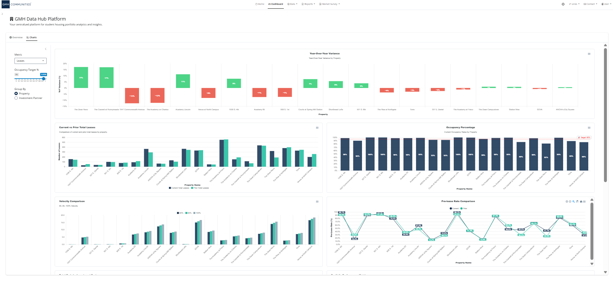

<!-- README.md is generated from README.Rmd. Please edit that file -->

<h1 align="center">

GMH Data Hub Platform R Package
</h1>

<p align="center">

<a href="CHANGELOG.md">Changelog</a> ·
<a href="https://docs.noclocks.dev/gmhdatahub/">Documentation</a> ·
<a href="https://github.com/noclocks/gmhdatahub/pkgs/container/gmhdatahub">Docker
Containers</a> · <a href="https://datahub.gmhcommunities.com">Live
App</a>
</p>

<p align="center">


</p>

<p align="center">


</p>

<p align="center">


</p>

------------------------------------------------------------------------

> **Note:** This is an R package built by [No Clocks,
> LLC](https://noclocks.dev) for [GMH
> Communities](https://gmhcommunities.com) for managing and maintaining
> their Leasing Data Hub Platform.

> **Warning:** This package is a work in progress.

------------------------------------------------------------------------

## Contents

- [Contents](#contents)
- [Badges](#badges)
- [Overview](#overview)
- [Installation](#installation)
- [App Architecture](#app-architecture)
  - [Core App Components](#core-app-components)
  - [Modules](#modules)
- [Resources](#resources)

## Badges

<!-- badges: start -->

[](https://github.com/noclocks/gmhdatahub/actions/workflows/docker-gcp.yml)
[](https://github.com/noclocks/gmhdatahub/actions/workflows/docker-ghcr.yml)
[](https://github.com/noclocks/gmhdatahub/actions/workflows/check.yml)
[](https://github.com/noclocks/gmhdatahub/actions/workflows/changelog.yml)
[](https://github.com/noclocks/gmhdatahub/actions/workflows/style.yml)
[](https://github.com/noclocks/gmhdatahub/actions/workflows/lint.yml)
[](https://github.com/noclocks/gmhdatahub/actions/workflows/roxygen.yml)
[](https://github.com/noclocks/gmhdatahub/actions/workflows/pkgdown.yml)
[](https://app.codecov.io/gh/noclocks/gmhdatahub)
[](https://github.com/noclocks/gmhdatahub/actions/workflows/dependabot/dependabot-updates)
<!-- badges: end -->

## Overview

The `gmhdatahub` package is a suite of functions, data, and system
components that build the foundation behind the *GMH Data Hub Platform*.
The platform serves the purpose of providing a centralized location for
analysis of various data involved at GMH Communities.

The package is designed to be used in conjunction with the GMH
Communities Data Hub Platform to provide a seamless experience for
managing and maintaining the platform.

## Installation

You can install the development version of `gmhdatahub` with the
following:

``` r
pak::pak("noclocks/gmhdatahub")
```

## App Architecture

The `gmhdatahub` package’s Shiny App consists of multiple modules and
functions that need to be properly integrated for a seamless workflow.

Below is a structured overview of the app’s architecture:

### Core App Components

Primary app entry point is `gmhdatahub::run_app()`, which initializes
the UI and server.

The app is divided into multiple modules, each handling a specific
aspect of the data hub platform:

- [`R/app_ui.R`](R/app_ui.R): Contains the UI components for the app.
- [`R/app_server.R`](R/app_server.R): Contains the server logic for the
  app.
- [`R/app_sidebar.R`](R/app_sidebar.R): Contains the sidebar logic for
  the app.
- [`R/app_theme.R`](R/app_theme.R): Contains the theme settings for the
  app.
- [`R/app_assets.R`](R/app_assets.R): Contains the asset settings for
  the app.

### Modules

The shiny app is modularized, with each module handling a specific
aspect of the data hub platform:

**Main Modules/Pages**:

- [`R/mod_home.R`](R/mod_home.R): Contains the home module for the app.
- [`R/mod_dashboard.R`](R/mod_dashboard.R): Contains the dashboard
  module for the app.
- [`R/mod_pre_lease.R`](R/mod_pre_lease.R): Contains the pre-lease
  module for the app.

plus,

- [`R/mod_custom_sign_in.R`](R/mod_custom_sign_in.R): Contains the
  custom sign-in module for the app.

**Survey Modules/Sections:**

- [`R/mod_survey_admin.R`](R/mod_survey_admin.R): Contains the survey
  admin module for the app.
- [`R/mod_survey_forms.R`](R/mod_survey_forms.R): Contains the survey
  forms module for the app.
  - [`R/mod_survey_property_summary.R`](R/mod_survey_property_summary.R):
    Contains the survey’s property summary section.
  - [`R/mod_survey_leasing_summary.R`](R/mod_survey_leasing_summary.R):
    Contains the survey’s leasing summary section.
  - [`R/mod_survey_fees_summary.R`](R/mod_survey_fees_summary.R):
    Contains the survey’s fees summary section.
  - [`R/mod_survey_short_term_leases.R`](R/mod_survey_short_term_leases.R):
    Contains the survey’s short-term leases section.
  - [`R/mod_survey_notes.R`](R/mod_survey_notes.R): Contains the
    survey’s notes section.
  - [`R/mod_survey_property_amenities.R`](R/mod_survey_property_amenities.R):
    Contains the survey’s property amenities section.
  - [`R/mod_survey_unit_amenities.R`](R/mod_survey_unit_amenities.R):
    Contains the survey’s unit amenities section.
  - [`R/mod_survey_utilities.R`](R/mod_survey_utilities.R): Contains the
    survey’s utilities section.
  - [`R/mod_survey_parking.R`](R/mod_survey_parking.R): Contains the
    survey’s parking section.
  - [`R/mod_survey_rents.R`](R/mod_survey_rents.R): Contains the
    survey’s rent tables section.
- [`R/mod_survey_insights.R`](R/mod_survey_insights.R): Contains the
  survey insights module for the app.
  - [`R/mod_survey_insights_trends.R`](R/mod_survey_insights_trends.R):
    Contains the survey insights trends section.
  - [`R/mod_survey_insights_comparison.R`](R/mod_survey_insights_comparison.R):
    Contains the survey insights comparison section.
  - [`R/mod_survey_insights_swot.R`](R/mod_survey_insights_swot.R):
    Contains the survey insights SWOT Analysis.

**Charts & Visuals**:

- [`R/chart_current_vs_prior.R`](R/chart_current_vs_prior.R): Contains
  the current vs. prior year chart.

- [`R/chart_occupancy.R`](R/chart_occupancy.R): Contains the occupancy
  chart.

- [`R/chart_partner_distribution.R`](R/chart_partner_distribution.R):
  Contains the partner distribution chart.

- [`R/chart_portfolio_summary.R`](R/chart_portfolio_summary.R): Contains
  the portfolio summary chart.

- [`R/chart_pre_lease_rates.R`](R/chart_pre_lease_rates.R): Contains the
  pre-lease rates chart.

- [`R/chart_velocity.R`](R/chart_valocity.R): Contains the leasing
  velocity chart.

- [`R/chart_weekly.R`](R/chart_weekly.R): Contains the weekly (pre-lease
  metrics) chart

- [`R/chart_yoy_variance.R`](R/chart_yoy_variance.R): Contains the
  year-over-year variance chart.

- [`R/map_survey_locations.R`](R/map_survey_locations.R): Contains the
  survey locations map.

- [`R/tbl_avg_rents_by_unit_type.R`](R/tbl_avg_rents_by_unit_type.R):
  Contains the average rents by unit type table.

- [`R/tbl_pre_lease_summary.R`](R/tbl_pre_lease_summary.R): Contains the
  pre-lease summary table.

- [`R/tbl_property_leasing_summary.R`](R/tbl_property_leasing_summary.R):
  Contains the property leasing summary table.

- [`R/tbl_recent_activity.R`](R/tbl_recent_activity.R): Contains the
  recent activity table.

- [`R/tbl_rents_by_floorplan.R`](R/tbl_rents_by_floorplan.R): Contains
  the rents by floorplan table.

- [`R/tbl_survey_locations.R`](R/tbl_survey_locations.R): Contains the
  survey locations table.

- [`R/tbl_survey_notes.R`](R/tbl_survey_notes.R): Contains the survey
  notes table.

- [`R/tbl_survey_property_competitors.R`](R/tbl_survey_property_competitors.R):
  Contains the survey property competitors table.

- [`R/tbl_survey_status.R`](R/tbl_survey_status.R): Contains the survey
  status table.

**Additional Components:**

- [`R/utils_cards.R`](R/utils_cards.R): Contains the utility cards for
  the app.
- [`R/utils_charts.R`](R/utils_charts.R): Contains the utility charts
  for the app.
- [`R/utils_maps.R`](R/utils_maps.R): Contains the utility maps for the
  app.

## Resources

- View the [CHANGELOG](CHANGELOG.md) for the latest updates.
- Visit the [Package Documentation
  Website](https://docs.noclocks.dev/gmhdatahub/)
- Visit the [Development Package Documentation
  Website](https://docs.noclocks.dev/gmhdatahub/develop/)
- Visit the [Live Data Hub Platform](https://datahub.gmhcommunities.com)
