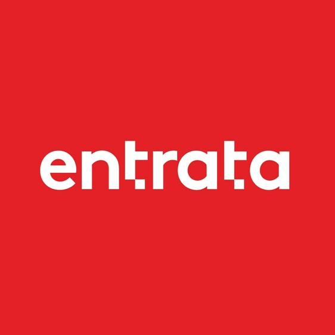

```{r, include = FALSE}
knitr::opts_chunk$set(
  collapse = TRUE,
  comment = "#>"
)
```

```{r setup}
# library(gmhdatahub)
```

## Entrata API Documentation 

## Properties Endpoint (/properties)

The `/propertiss` endpoint provides access to property information.

- **Request URL**: https://gmhcommunities.com/entrata/api/v1/properties

All requests to the `/properties` endpoint must be authenticated with a valid username and password.

- **Username** (string, required): Username for authentication.
- **Password** (string, required): Password for authentication.

Currently we use the following methods for `/properties`:

- **getProperties**: Retrieves website information for specified property IDs.
- **getFloorPlans**:
- **getPhoneNumber**:
- **getPropertyAddOns**:
- **getRentableItems**:
- **getWebsites**:
- **getReservableAmenities**:

with `getProperties` being the most commonly used method.

### Method: getProperties

- **Description**: Retrieves website information for specified property IDs.

- **Parameters**:
  - **propertyIds** (string, optional): A comma-separated list of property IDs to filter the response.
  - **propertyLookupCode** (string, optional): Property lookup code.
  - **showAllStatus** (boolean, optional): Whether to show all status information (true/false).

- **Request Headers**:

```plaintext
Content-Type: APPLICATION/JSON; CHARSET=UTF-8
Authorization: Basic REDACTED
```
  
- **Response Headers**:

```plaintext
access-control-allow-origin: *
access-control-expose-headers: Link, X-Total-Count, X-RateLimit-Limit, X-RateLimit-Remaining, X-RateLimit-Reset, Content-Language
alt-svc: h3=":443"; ma=86400
cf-cache-status: DYNAMIC
cf-ray: 8e18d24d3fa5dd1a-ATL
content-encoding: br
content-language: en-US
content-type: application/json;charset=utf-8
date: Tue, 12 Nov 2024 19:10:20 GMT
server: cloudflare
vary: Authorization
x-ratelimit-limit: 15000/day;1000/hour;150/minute
x-ratelimit-remaining: 14996/day;999/hour;149/minute
x-ratelimit-reset: 42580;2980;40
x-read-only: 000
```

- **Request Body**:

<details><summary>View Full Request JSON:</summary><p>

```json
{
	"auth": {
		"type" : "basic"
	},
	"requestId" : 15,
	"method": {
		"name": "getProperties",
		"version":"r1",
		"params": {
			"propertyIds" : "739076,739085",
			"propertyLookupCode" : "GMH",
			"showAllStatus" : "1"
		}
	}
}
```

</p></details>

- **Response Body**:

<details><summary>View Full Response JSON:</summary><p>

```json
{
  "response": {
    "requestId": "15",
    "code": 200,
    "result": {
      "PhysicalProperty": {
        "Property": [
          {
            "PropertyID": 739076,
            "MarketingName": "1008 S. 4th",
            "Type": "Student",
            "webSite": "https://www.theacademycampustown.com/",
            "Address": {
              "@attributes": {
                "AddressType": "property"
              },
              "Address": "1008 S. 4th",
              "City": "Champaign",
              "State": "IL",
              "PostalCode": "61820",
              "Country": "US",
              "Email": "info@theacademycampustown.com"
            },
            "Addresses": {
              "Address": [
                {
                  "AddressType": "Primary",
                  "Address": "1008 S. 4th",
                  "City": "Champaign",
                  "StateCode": "IL",
                  "PostalCode": "61820",
                  "Country": "US"
                },
                {
                  "AddressType": "Mailing",
                  "Address": "708 South 6th Street",
                  "City": "Champaign",
                  "StateCode": "IL",
                  "PostalCode": "61820",
                  "Country": "US"
                }
              ]
            },
            "PostMonths": {
              "ArPostMonth": "11/2024",
              "ApPostMonth": "11/2024",
              "GlPostMonth": "11/2024"
            },
            "PropertyHours": {
              "OfficeHours": {
                "OfficeHour": [
                  {
                    "Day": "Monday",
                    "AvailabilityType": "Open",
                    "OpenTime": "10:00 AM",
                    "CloseTime": "6:00 PM"
                  },
                  {
                    "Day": "Sunday",
                    "AvailabilityType": "Open",
                    "OpenTime": "12:00 PM",
                    "CloseTime": "4:00 PM"
                  },
                  {
                    "Day": "Saturday",
                    "AvailabilityType": "Open",
                    "OpenTime": "10:00 AM",
                    "CloseTime": "4:00 PM"
                  },
                  {
                    "Day": "Tuesday",
                    "AvailabilityType": "Open",
                    "OpenTime": "10:00 AM",
                    "CloseTime": "6:00 PM"
                  },
                  {
                    "Day": "Wednesday",
                    "AvailabilityType": "Open",
                    "OpenTime": "10:00 AM",
                    "CloseTime": "6:00 PM"
                  },
                  {
                    "Day": "Thursday",
                    "AvailabilityType": "Open",
                    "OpenTime": "10:00 AM",
                    "CloseTime": "6:00 PM"
                  },
                  {
                    "Day": "Friday",
                    "AvailabilityType": "Open",
                    "OpenTime": "10:00 AM",
                    "CloseTime": "6:00 PM"
                  }
                ]
              }
            },
            "IsDisabled": 0,
            "IsFeaturedProperty": 0,
            "SpaceOptions": {
              "SpaceOption": [
                {
                  "Id": "2",
                  "Name": "Private"
                },
                {
                  "Id": "3",
                  "Name": "Shared"
                },
                {
                  "Id": "22",
                  "Name": "Per Bedroom"
                }
              ]
            },
            "LeaseTerms": {
              "LeaseTerm": [
                {
                  "Id": 11009,
                  "Name": "Spring Semester 2021",
                  "TermMonths": 5,
                  "IsProspect": true,
                  "IsRenewal": true
                },
                {
                  "Id": 11008,
                  "Name": "2020 Fall Semester",
                  "TermMonths": 5,
                  "IsProspect": true,
                  "IsRenewal": true
                },
                {
                  "Id": 11037,
                  "Name": "2021 Fall Semester",
                  "TermMonths": 5,
                  "IsProspect": true,
                  "IsRenewal": true
                },
                {
                  "Id": 11004,
                  "Name": "2020/2021 6 Month Lease",
                  "TermMonths": 5,
                  "IsProspect": true,
                  "IsRenewal": false
                },
                {
                  "Id": 11096,
                  "Name": "2021/2022 6 Month Lease",
                  "TermMonths": 6,
                  "IsProspect": true,
                  "IsRenewal": true
                },
                {
                  "Id": 11005,
                  "Name": "2020/2021 9 Month Lease",
                  "TermMonths": 10,
                  "IsProspect": true,
                  "IsRenewal": false
                },
                {
                  "Id": 11909,
                  "Name": "Annual",
                  "TermMonths": 12,
                  "IsProspect": true,
                  "IsRenewal": true,
                  "LeaseStartWindows": {
                    "LeaseStartWindow": [
                      {
                        "Id": 9861,
                        "WindowStartDate": "08/15/2025",
                        "WindowEndDate": "07/30/2026"
                      }
                    ]
                  }
                },
                {
                  "Id": 11458,
                  "Name": "Transfer 2024/2025",
                  "TermMonths": 12,
                  "IsProspect": false,
                  "IsRenewal": true,
                  "LeaseStartWindows": {
                    "LeaseStartWindow": [
                      {
                        "Id": 9335,
                        "WindowStartDate": "08/16/2024",
                        "WindowEndDate": "07/30/2025"
                      }
                    ]
                  }
                },
                {
                  "Id": 10894,
                  "Name": "Immediate Move In 2020/2021",
                  "TermMonths": 12,
                  "IsProspect": true,
                  "IsRenewal": true
                },
                {
                  "Id": 11121,
                  "Name": "2022/2023",
                  "TermMonths": 12,
                  "IsProspect": true,
                  "IsRenewal": true
                },
                {
                  "Id": 11910,
                  "Name": "MOMI",
                  "TermMonths": 12,
                  "IsProspect": false,
                  "IsRenewal": true,
                  "LeaseStartWindows": {
                    "LeaseStartWindow": [
                      {
                        "Id": 9865,
                        "WindowStartDate": "08/15/2025",
                        "WindowEndDate": "07/30/2026"
                      }
                    ]
                  }
                },
                {
                  "Id": 11020,
                  "Name": "Immediate Move-In 2021/2022",
                  "TermMonths": 12,
                  "IsProspect": true,
                  "IsRenewal": true
                },
                {
                  "Id": 11457,
                  "Name": "2024/2025",
                  "TermMonths": 12,
                  "IsProspect": true,
                  "IsRenewal": true,
                  "LeaseStartWindows": {
                    "LeaseStartWindow": [
                      {
                        "Id": 9331,
                        "WindowStartDate": "08/16/2024",
                        "WindowEndDate": "07/30/2025"
                      }
                    ]
                  }
                },
                {
                  "Id": 11199,
                  "Name": "2023/2024",
                  "TermMonths": 12,
                  "IsProspect": true,
                  "IsRenewal": true
                },
                {
                  "Id": 10891,
                  "Name": "2019/2020",
                  "TermMonths": 13,
                  "IsProspect": true,
                  "IsRenewal": true
                }
              ]
            }
          },
          {
            "PropertyID": 739085,
            "MarketingName": "1047 Commonwealth Avenue",
            "Type": "Student",
            "webSite": "https://1047commonwealthavenue.prospectportal.com/",
            "Address": {
              "@attributes": {
                "AddressType": "property"
              },
              "Address": "1047 Commonwealth Avenue",
              "City": "Boston",
              "State": "MA",
              "PostalCode": "02215",
              "Country": "US",
              "Email": "info@1047commonwealth.com"
            },
            "Addresses": {
              "Address": [
                {
                  "AddressType": "Primary",
                  "Address": "1047 Commonwealth Avenue",
                  "City": "Boston",
                  "StateCode": "MA",
                  "PostalCode": "02215",
                  "Country": "US"
                }
              ]
            },
            "Phone": {
              "PhoneNumber": "6173510288",
              "@attributes": {
                "PhoneType": "primary"
              },
              "PhoneDescription": "Primary"
            },
            "PostMonths": {
              "ArPostMonth": "11/2024",
              "ApPostMonth": "11/2024",
              "GlPostMonth": "11/2024"
            },
            "PropertyHours": {
              "OfficeHours": {
                "OfficeHour": [
                  {
                    "Day": "Monday",
                    "AvailabilityType": "Open",
                    "OpenTime": "10:00 AM",
                    "CloseTime": "6:00 PM"
                  },
                  {
                    "Day": "Tuesday",
                    "AvailabilityType": "Open",
                    "OpenTime": "10:00 AM",
                    "CloseTime": "6:00 PM"
                  },
                  {
                    "Day": "Wednesday",
                    "AvailabilityType": "Open",
                    "OpenTime": "10:00 AM",
                    "CloseTime": "6:00 PM"
                  },
                  {
                    "Day": "Thursday",
                    "AvailabilityType": "Open",
                    "OpenTime": "10:00 AM",
                    "CloseTime": "6:00 PM"
                  },
                  {
                    "Day": "Friday",
                    "AvailabilityType": "Open",
                    "OpenTime": "10:00 AM",
                    "CloseTime": "6:00 PM"
                  }
                ]
              }
            },
            "IsDisabled": 0,
            "IsFeaturedProperty": 0,
            "SpaceOptions": {
              "SpaceOption": [
                {
                  "Id": "2",
                  "Name": "Private"
                },
                {
                  "Id": "3",
                  "Name": "Shared"
                }
              ]
            },
            "LeaseTerms": {
              "LeaseTerm": [
                {
                  "Id": 11007,
                  "Name": "Group",
                  "TermMonths": 1,
                  "IsProspect": true,
                  "IsRenewal": true
                },
                {
                  "Id": 10888,
                  "Name": "6 months",
                  "TermMonths": 6,
                  "IsProspect": true,
                  "IsRenewal": true
                },
                {
                  "Id": 10887,
                  "Name": "9 months",
                  "TermMonths": 9,
                  "IsProspect": true,
                  "IsRenewal": true
                },
                {
                  "Id": 12060,
                  "Name": "Academic Year",
                  "TermMonths": 10,
                  "IsProspect": true,
                  "IsRenewal": true,
                  "LeaseStartWindows": {
                    "LeaseStartWindow": [
                      {
                        "Id": 9988,
                        "WindowStartDate": "08/17/2024",
                        "WindowEndDate": "05/31/2025"
                      }
                    ]
                  }
                },
                {
                  "Id": 11130,
                  "Name": "2022/2023",
                  "TermMonths": 12,
                  "IsProspect": true,
                  "IsRenewal": true
                },
                {
                  "Id": 10955,
                  "Name": "2021 Lease Term",
                  "TermMonths": 12,
                  "IsProspect": true,
                  "IsRenewal": true
                },
                {
                  "Id": 10954,
                  "Name": "2020 Lease Term",
                  "TermMonths": 12,
                  "IsProspect": true,
                  "IsRenewal": true
                },
                {
                  "Id": 10878,
                  "Name": "2019/2020",
                  "TermMonths": 12,
                  "IsProspect": true,
                  "IsRenewal": true
                },
                {
                  "Id": 11226,
                  "Name": "2023/2024",
                  "TermMonths": 12,
                  "IsProspect": true,
                  "IsRenewal": true
                },
                {
                  "Id": 11529,
                  "Name": "2024/2025",
                  "TermMonths": 12,
                  "IsProspect": true,
                  "IsRenewal": true,
                  "LeaseStartWindows": {
                    "LeaseStartWindow": [
                      {
                        "Id": 9377,
                        "WindowStartDate": "08/17/2024",
                        "WindowEndDate": "07/31/2025"
                      }
                    ]
                  }
                },
                {
                  "Id": 11530,
                  "Name": "Transfer 2024/2025",
                  "TermMonths": 12,
                  "IsProspect": false,
                  "IsRenewal": true,
                  "LeaseStartWindows": {
                    "LeaseStartWindow": [
                      {
                        "Id": 9378,
                        "WindowStartDate": "08/17/2024",
                        "WindowEndDate": "07/31/2025"
                      }
                    ]
                  }
                },
                {
                  "Id": 11924,
                  "Name": "Annual",
                  "TermMonths": 12,
                  "IsProspect": true,
                  "IsRenewal": true,
                  "LeaseStartWindows": {
                    "LeaseStartWindow": [
                      {
                        "Id": 9882,
                        "WindowStartDate": "08/18/2025",
                        "WindowEndDate": "07/31/2026"
                      }
                    ]
                  }
                },
                {
                  "Id": 11925,
                  "Name": "MOMI",
                  "TermMonths": 12,
                  "IsProspect": false,
                  "IsRenewal": true,
                  "LeaseStartWindows": {
                    "LeaseStartWindow": [
                      {
                        "Id": 9883,
                        "WindowStartDate": "08/18/2025",
                        "WindowEndDate": "07/31/2026"
                      }
                    ]
                  }
                },
                {
                  "Id": 10886,
                  "Name": "12 months",
                  "TermMonths": 12,
                  "IsProspect": true,
                  "IsRenewal": true
                }
              ]
            }
          }
        ]
      }
    }
  }
}
```

</p></details>
